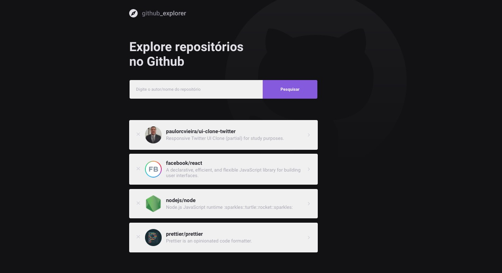

# :octocat: Github Explorer

    

 

<a href="https://jovial-ardinghelli-cc66de.netlify.app/" target="_blank">Deployed</a>

## 💻 Project
- Project developed during <strong> Bootcamp GoStack # 13 </strong> that has the educational objective.
<strong> Github Explorer </strong> is an application where the user can list their favorite repositories.

## :rocket: Technologies

- [x] React.JS
- [x] TypeScript
- [x] Styled Components
- [x] Axios

## :arrow_forward:  Usage

1. Run `yarn install` or `npm install`. 
2. Run `yarn start` and access `http://localhost:3000`. 

## 🛠 Contributing

- Please read [CONTRIBUTING.md](CONTRIBUTING.md) for details on our code of conduct, and the process for submitting pull requests.

## 🧾 Licence

- Please read [LICENSE](LICENSE.md) for details.

---

Made with 💜 &nbsp; by [Paulo Vieira](https://www.linkedin.com/in/paulorcvieira/)
